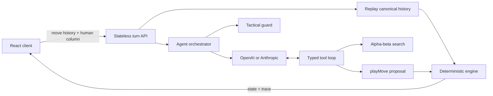

# Connect Four Agent

A production-minded Connect Four environment where a human plays against a
hybrid LLM and alpha-beta search agent.

This is intentionally not an LLM wrapper. The model cannot edit the board. A
deterministic engine owns all state transitions, the model operates through
typed tools, every proposed action is validated, and each turn produces an
inspectable execution trace.

## Run locally

Requirements: Node.js 22+ and npm.

```bash
npm install
cp .env.example .env
npm run dev
```

Add at least one provider key to `.env`:

```dotenv
OPENAI_API_KEY=
OPENAI_MODEL=gpt-5.4-mini
ANTHROPIC_API_KEY=
ANTHROPIC_MODEL=claude-haiku-4-5
AGENT_PROVIDER=openai
```

Open the URL printed by Next.js. If no model key is configured, the UI clearly
reports degraded mode and the deterministic search policy keeps the game
playable.

## Architecture



### State ownership

- The board is a pure, immutable `GameState`.
- Only `applyMove` can create the next state.
- The server accepts move history, not a client-authored board.
- The API reconstructs state by replaying every move through the engine.
- Browser storage holds canonical move history for refresh/reconnect.
- No server process memory is required, so local and Vercel behavior match.

This stateless demo architecture also prevents one browser's game from affecting
another. Durable cross-device sessions would replace browser storage with an
append-only PostgreSQL move table and optimistic game versions.

## Agent loop

The system instruction is stable and defines the objective, role, immutable
rules, decision priorities, and tool-only action boundary. Every turn adds a
fresh user observation containing:

- The complete 6x7 board.
- Current player.
- Legal columns.
- Canonical move history.
- Validation feedback from a prior invalid proposal, when applicable.

The AI SDK maintains the assistant/tool messages within that turn. Across game
turns, the server sends the current authoritative observation again instead of
replaying conversational prose. This avoids context drift and keeps serverless
requests stateless.

### Tools

| Tool | Purpose |
| --- | --- |
| `getLegalMoves` | Observe columns accepted by the current engine state |
| `analyzeMoves` | Rank legal actions with bounded alpha-beta search |
| `inspectMove` | Check one candidate for wins, blocks, and tactical risk |
| `playMove` | Propose a typed `{ column, explanation }` action |

The model is required to use tools and finish with `playMove`. The orchestrator
validates the selected column against the unchanged state. An illegal proposal
gets one corrective retry; a second invalid proposal, timeout, provider error,
or missing key activates an explicit search fallback.

Immediate wins and forced blocks are deterministic tactical guards. They avoid
spending latency or tokens on decisions with only one rational action.

## Search

The tactical engine uses:

- Alpha-beta minimax from the current player's perspective.
- Center-first move ordering to improve pruning.
- Immediate terminal scoring that prefers faster wins and slower losses.
- Four-cell window scoring across horizontal, vertical, and both diagonal axes.
- Configurable depth: easy 2, medium 4, hard 6.
- Principal variations, category labels, node count, and duration in its result.

Search is both an agent tool and the transparent reliability fallback.

## Observability

The UI exposes a per-turn trace with:

- Strategy (`llm-tools`, `tactical-guard`, or `search-fallback`).
- Provider and model version.
- Legal moves and game version.
- Tool calls and results.
- Ranked search candidates and principal variations.
- Search depth, explored nodes, and latency.
- Model attempts and token usage.
- Explicit fallback reason.

No API key or hidden model reasoning is included in the trace.

## API

`POST /api/turn`

```json
{
  "moves": [3, 2],
  "column": 3,
  "difficulty": "medium",
  "provider": "openai"
}
```

The server validates the request with Zod, replays `moves`, applies the human
move, runs the agent if the game remains active, validates the agent action
against the expected game version, and returns the new state plus trace.

`GET /api/config` reports which providers are available and their public model
names. It never returns credentials.

## Verification

```bash
npm test       # deterministic engine, search, orchestration, history
npm run eval   # tactical fixtures and seeded baseline matches
npm run lint
npm run build
```

The evaluation suite checks immediate wins, mandatory blocks, center preference,
full-column avoidance, legality, and seeded matches against random and shallow
heuristic baselines.

Current deterministic baseline:

```text
Tactical accuracy: 5/5 (100%)
search vs random: 20-0-0
search vs heuristic: 20-0-0
0 illegal moves
```

The seeded suite is a regression gate, not a claim that Connect Four is solved.
A production evaluation pipeline would add deeper-search regret, historical
position replay, prompt/model version comparisons, latency, and cost budgets.

## Failure handling

| Failure | Behavior |
| --- | --- |
| Invalid request/history | Reject before invoking a model |
| Full or out-of-range column | Deterministic engine error |
| Model proposes illegal move | Return validation feedback and retry once |
| Model timeout/provider error | Visible deterministic search fallback |
| Missing provider key | Visible deterministic search fallback |
| Stale agent action | Reject if the game version changed |
| Refresh | Rebuild state by replaying browser-stored move history |

## Project structure

```text
src/
  agent/
    ai-sdk-model.ts     # OpenAI/Anthropic tool loop
    orchestrator.ts     # guards, retries, fallback, trace
    search/             # alpha-beta search and evaluation
  app/
    api/                # stateless server routes
    page.tsx            # playable UI and trace inspector
  domain/connect4/      # authoritative rules and state transitions
  evals/                # seeded tactical and head-to-head evaluation
  game/                 # history replay and shared API contracts
```

## Production path

1. Persist games, move events, agent versions, and traces in PostgreSQL.
2. Use optimistic `game_version` checks and idempotency keys for every move.
3. Move model turns to a retryable worker queue and stream completion with SSE.
4. Add authentication, authorization by game owner, and per-user spend limits.
5. Emit OpenTelemetry spans across API, replay, search, model calls, and storage.
6. Pin an agent version per game and use seeded evaluations, canaries, and
   rollback thresholds for model/prompt/tool changes.

See [`ROADMAP.md`](./ROADMAP.md) for the complete delivery and scaling plan.
