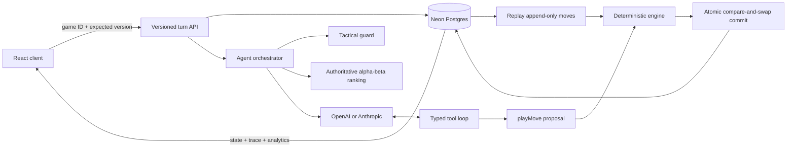

# Connect Four Agent

A production-minded Connect Four environment where a human plays against a
hybrid LLM and alpha-beta search agent.

**Live demo:** https://netic-onsite.vercel.app  
**Public evaluations:** https://netic-onsite.vercel.app/evals

This is intentionally not an LLM wrapper. The model cannot edit the board. A
deterministic engine owns all state transitions, the model operates through
typed tools, every proposed action is validated, and each turn produces an
inspectable execution trace.

## Run locally

Requirements: Node.js 22+ and npm.

```bash
npm install
cp .env.example .env
npm run db:migrate
npm run dev
```

Add at least one provider key to `.env`:

```dotenv
OPENAI_API_KEY=
OPENAI_MODEL=gpt-5.4-mini
ANTHROPIC_API_KEY=
ANTHROPIC_MODEL=claude-haiku-4-5
AGENT_PROVIDER=openai
DATABASE_URL=
```

Open the URL printed by Next.js. If no model key is configured, the UI clearly
reports degraded mode and the deterministic search policy keeps the game
playable.

## Architecture



### State ownership

- The board is a pure, immutable `GameState`.
- Only `applyMove` can create the next state.
- PostgreSQL stores games, append-only moves, command IDs, and agent traces.
- The API reconstructs state by replaying database moves through the engine.
- Browser storage holds only the durable game ID and a validated local cache.
- The client applies the human move optimistically so the yellow token renders
  immediately, then reconciles with canonical server state or rolls back on error.
- Every command carries `expectedVersion` and a UUID idempotency key.
- A single SQL statement commits both human and agent moves only when the stored
  version still matches.
- No server process memory is required, so Vercel functions scale horizontally.

Model execution occurs before the atomic database commit and outside a database
transaction. Competing requests can both calculate, but PostgreSQL allows only
one to commit; the loser receives `409 VERSION_CONFLICT` and reloads canonical
state. Retrying the winning idempotency key returns the existing result.

## Agent loop

The system instruction is stable and defines the objective, role, immutable
rules, decision priorities, and tool-only action boundary. Every turn adds a
fresh user observation containing:

- The complete 6x7 board.
- Current player.
- Legal columns.
- The authoritative fixed-depth move ranking.
- The single search-selected admissible column.
- Canonical move history.
- Validation feedback from a prior invalid proposal, when applicable.

The AI SDK maintains the assistant/tool messages within that turn. Across game
turns, the server sends the current authoritative observation again instead of
replaying conversational prose. This avoids context drift and keeps serverless
requests stateless.

### Tools

| Tool | Purpose |
| --- | --- |
| `getLegalMoves` | Observe columns accepted by the current engine state |
| `analyzeMoves` | Return the orchestrator's precomputed authoritative ranking |
| `inspectMove` | Check one candidate for wins, blocks, and tactical risk |
| `playMove` | Propose a typed `{ column, explanation }` action |

The orchestrator ranks all legal moves at depth 6. When the leading scores are
within 12 points, it selectively reruns only those root candidates at depth 7,
then selects the first result using deterministic score and center-first
ordering. Exactly one column is admissible. The model explains that move; it
does not establish search depth, move quality, or the selected action.

The model is required to use tools and finish with `playMove`. The orchestrator
accepts the proposal only when it is both legal and admissible against the
unchanged state. An illegal or lower-ranked proposal gets precise feedback and
one corrective retry. A second rejection, timeout, provider error, or missing key
activates an explicit fallback to the first top-ranked move. Temperature zero
reduces sampling variance, but correctness comes from this deterministic gate.

Immediate wins and forced blocks are deterministic tactical guards. They avoid
spending model latency or tokens on decisions with only one rational action.

## Search

The tactical engine uses:

- Alpha-beta minimax from the current player's perspective.
- Center-first move ordering to improve pruning.
- Immediate terminal scoring that prefers faster wins and slower losses.
- Four-cell window scoring across horizontal, vertical, and both diagonal axes.
- Fixed depth 6 with selective depth-7 refinement for candidates within 12
  points of the leading heuristic score.
- Principal variations, category labels, node count, and duration in its result.

Search is the authoritative policy gate and transparent reliability fallback.
Its interface produces a ranked move set, so a future exact solver can replace
the fixed-depth implementation without changing orchestration semantics.

## Observability

The UI exposes a per-turn trace with:

- Strategy (`llm-tools`, `tactical-guard`, or `search-fallback`).
- Provider and model version.
- Legal moves and game version.
- Tool calls and results.
- Ranked search candidates and principal variations.
- Search depth, explored nodes, and latency.
- Model attempts and token usage.
- Explicit fallback reason.

No API key or hidden model reasoning is included in the trace.

Aggregate analytics are computed directly from normalized game and move events:
games, outcomes, model/tool strategies, fallback rate, model latency, and token
usage. The UI shows live totals without exposing individual users or prompts.

## Evaluation platform

The public **Evaluations** tab benchmarks fixed search depths 1 through 8 against
28 versioned board positions. A slider controls the depth, and each case compares
the selected column with one or more accepted golden moves while recording search
latency and explored nodes in PostgreSQL. No model call is made, so the results
isolate the precision-versus-compute tradeoff instead of provider latency.

The `pons-golden-v2` dataset samples wins, mandatory blocks, tactics, strategy,
and endgames from
Pascal Pons' public
[GameSolver benchmarks](http://blog.gamesolver.org/solving-connect-four/02-test-protocol/).
Per-column exact minimax scores were captured once from the public solver API and
checked into the repository. The app derives every golden move by taking the
maximum score among legal columns and validates the position and score vector at
module load and in tests.

This is intentionally offline and reproducible: production evaluation runs never
depend on the external solver service and no AGPL solver code is included. The
popular UCI Connect-4 dataset was not used because it labels position outcomes,
not the best action for each legal move.

Runs execute one scenario per request so progress is durable across serverless
invocations. Duplicate case requests are idempotent, partial runs remain
inspectable, and public creation is capped at 100 selected cases per hour to
bound compute. Every run records `fixed-depth-search-v1` plus its selected depth;
legacy agent runs remain inspectable but cannot resume as search benchmarks.

### Automated data generation

The fixed suite is complemented by a seeded, deterministic arena:

```bash
# Play 500 complete games and export 50 diverse candidate positions.
npm run eval:generate -- \
  --games 500 \
  --player-one random \
  --player-two search \
  --candidates 50 \
  --baseline-depth 7

# Run the production agent on a bounded sample of generated positions.
npm run eval:generated -- \
  --provider openai \
  --limit 10
```

The arena plays full games without model calls, captures agent-to-move
positions, removes duplicate and mirrored boards, and samples across opening,
midgame, and endgame stages. It labels candidates with the deeper local
alpha-beta baseline and records that the labels are **approximate**, not exact.
The same seed and options produce the same games and output.

Generated positions are discovery data. High-value failures can be exact-solved
offline and promoted into a new golden dataset version; they are never silently
mixed into the exact public benchmark.

## API

`POST /api/games` creates a durable game.

`GET /api/games/:gameId` reconstructs its authoritative state.

`POST /api/games/:gameId/turns`

```json
{
  "column": 3,
  "expectedVersion": 2,
  "idempotencyKey": "08adc0d8-8c52-48bc-ae6e-2631ff25cf26",
  "provider": "openai"
}
```

The server validates the request with Zod, loads canonical moves, applies the
human move, runs the agent if the game remains active, and atomically commits the
complete turn against the expected version.

`GET /api/config` reports which providers are available and their public model
names. It never returns credentials.

`GET /api/analytics` returns aggregate gameplay and agent-operational metrics.

`GET /api/evals` returns the current versioned scenario set and recent durable
runs.

`POST /api/evals/runs` creates a fixed-depth search benchmark:

```json
{
  "scenarioIds": ["opening-conversion", "central-winning-plan"],
  "searchDepth": 6
}
```

`GET /api/evals/runs/:runId` reloads its progress and case results.

`POST /api/evals/runs/:runId/cases` executes and atomically records one selected
scenario. Retrying an already-recorded case returns the existing run unchanged.

The original stateless `POST /api/turn` remains as a local fallback when
`DATABASE_URL` is not configured.

## Verification

```bash
npm test       # engine, search, orchestration, golden data, simulations
npm run eval   # tactical fixtures and seeded baseline matches
npm run eval:generate
npm run eval:generated -- --provider openai --limit 10
npm run db:migrate
npm run lint
npm run build
```

The deterministic suite checks immediate wins, mandatory blocks, center
preference, full-column avoidance, legality, seeded matches against random and
shallow heuristic baselines, and all golden dataset invariants.

Current deterministic baseline:

```text
Tactical accuracy: 5/5 (100%)
search vs random: 20-0-0
search vs heuristic: 20-0-0
0 illegal moves
```

The seeded suite is a regression gate, while the web platform measures fixed-depth
search accuracy, latency, and node count against exact solved positions. A larger
production suite would add game-theoretic regret, historical position replay,
holdout positions, and explicit compute budgets.

## Failure handling

| Failure | Behavior |
| --- | --- |
| Invalid request/history | Reject before invoking a model |
| Full or out-of-range column | Deterministic engine error |
| Model proposes illegal move | Return validation feedback and retry once |
| Model proposes legal lower-ranked move | Reject, retry once, then use top-ranked move |
| Model timeout/provider error | Visible deterministic search fallback |
| Missing provider key | Visible deterministic search fallback |
| Concurrent/stale action | Atomic version check; one commit, one `409` |
| Duplicate request | Idempotency key returns current canonical result |
| Refresh/new instance | Reload and replay PostgreSQL move events |

## Project structure

```text
src/
  agent/
    ai-sdk-model.ts     # OpenAI/Anthropic tool loop
    orchestrator.ts     # guards, retries, fallback, trace
    search/             # alpha-beta search and evaluation
  app/
    api/                # versioned game, analytics, and evaluation routes
    evals/              # public evaluation workspace
    page.tsx            # playable UI and trace inspector
  db/                   # Neon schema, game/eval repositories, CAS commits
  domain/connect4/      # authoritative rules and state transitions
  evals/                # golden dataset, evaluator, automated arena, CLIs
  game/                 # history replay and shared API contracts
```

## Production path

1. Move model turns to a retryable worker queue and stream completion with SSE.
2. Add authentication, authorization by game owner, and per-user spend limits.
3. Emit OpenTelemetry spans across API, replay, search, model calls, and storage.
4. Pin an agent version per game and use seeded evaluations, canaries, and
   rollback thresholds for model/prompt/tool changes.

See [`ROADMAP.md`](./ROADMAP.md) for the complete delivery and scaling plan.
