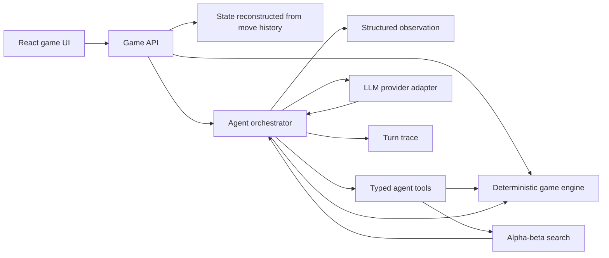

# Connect 4 Agent Roadmap

## Goal

By **2:45 PM**, deliver a polished web application where a human can play a
complete Connect 4 game against an LLM-powered agent both locally and at a
public Vercel URL. The project should demonstrate more than prompt engineering:
deterministic environment design, typed agent tools, tactical search, failure
handling, evaluation, and a credible path to production.

The strategy is **depth over feature count**. A small, coherent system with clear
boundaries and evidence that it works is more defensible than many unfinished
features.

**Current status:** the core product, Vercel deployment, Neon persistence,
optimistic concurrency, idempotency, aggregate analytics, and public golden-move
evaluation workspace are shipped. The remaining roadmap describes the next
scaling steps rather than incomplete MVP work.

## Product Slice for the On-Site

### Must ship

- A local web UI for a complete human-versus-agent game.
- A public Vercel deployment that presenters can play independently.
- An authoritative, deterministic Connect 4 engine.
- Validation for turns, full columns, terminal games, wins, and draws.
- An LLM agent that receives structured observations and returns typed actions.
- A tactical search tool the agent can use instead of relying only on language
  model intuition.
- Explicit handling for timeouts, malformed output, and provider errors.
- A visible per-turn trace: observation, tools used, selected move, explanation,
  latency, and whether fallback was used.
- Automated unit tests for the engine and tactical agent behavior.
- A small repeatable evaluation suite.
- Documentation covering architecture, tradeoffs, local setup, and scaling.

### Ship if the core is stable

- Difficulty levels implemented as different search depths/tool budgets.
- Game replay from an append-only move history.
- Agent-versus-agent evaluation.
- Model/provider selection through configuration.

### Deliberately defer

- Authentication and human-versus-human multiplayer.
- Distributed queues, Redis, and Kubernetes.
- Streaming token-by-token model output.
- Elaborate animation or visual design.

These are poor uses of the two-hour implementation window and do not strengthen
the core agent design.

## Recommended Architecture

Use a single TypeScript codebase:

- **Next.js + React** for a polished local UI and server API in one process.
- **Pure TypeScript domain module** for rules and state transitions.
- **Zod** schemas at API and model boundaries.
- **Vitest** for fast deterministic unit and evaluation tests.
- **LLM provider adapter** selected from environment configuration.



### Boundary rules

1. **The engine owns truth.** Only `applyMove` can change a board.
2. **The agent never edits state.** It can observe state, inspect legal moves,
   request analysis, and propose a column.
3. **The API orchestrates turns.** It reconstructs authoritative state by
   replaying move history, applies the human move, invokes the agent, validates
   the proposed action, and applies the agent move.
4. **The model is untrusted input.** All output is schema-validated and checked
   against current legal moves.
5. **Every decision is inspectable.** A turn records model/config version, tool
   calls, action, explanation, latency, and errors.

Suggested modules:

```text
src/
  app/                  # UI and server routes
  domain/connect4/      # board, moves, terminal-state detection
  agent/                # orchestrator, prompts, tools, provider adapter
  agent/search/         # heuristic scoring and alpha-beta minimax
  game/                 # stateless turn use cases and history replay
  observability/        # structured turn traces
  evals/                # tactical fixtures and match runner
```

## Agent Design: More Than a GPT Wrapper

### Observation

Send a compact structured state rather than an ambiguous board-only prompt:

- Board as six rows and seven columns.
- Agent and human piece identities.
- Whose turn it is.
- Legal columns.
- Move history.
- Terminal status.
- The objective and immutable game rules.

### Tools

- `get_legal_moves()` returns columns valid for the current state.
- `analyze_moves(depth)` runs deterministic alpha-beta search and returns ranked
  moves with scores and principal variations.
- `inspect_move(column)` reports immediate wins, blocks, and tactical risks.
- `play_move(column, explanation)` proposes an action; the engine still performs
  final validation and application.

### Decision loop

1. Build an immutable observation from the current state.
2. Apply deterministic tactical guards: take an immediate win and identify
   mandatory blocks.
3. Let the LLM inspect legal moves and call bounded analysis tools.
4. Require a typed `play_move` action.
5. Validate the action against the unchanged game version.
6. Retry once with the validation error if the action is malformed or illegal.
7. On provider failure, visibly use a deterministic search fallback and record
   the degraded decision in the trace.

This design uses the LLM for planning, tool selection, explanation, and strategic
choice while keeping rules and safety deterministic. The fallback is explicit,
not silent.

## Build Plan to 2:45 PM

### 12:45-1:10 — Phase 1: Authoritative game engine

Build the state model and pure operations:

- Create a 6x7 board.
- List legal moves.
- Drop a piece with gravity.
- Detect horizontal, vertical, and both diagonal wins.
- Detect a draw.
- Reject invalid columns, full columns, wrong turns, and moves after game end.
- Preserve append-only move history.

Add table-driven tests for every rule, especially edge diagonals and terminal
state behavior.

**Exit criterion:** tests prove full games cannot enter an invalid state.

### 1:10-1:35 — Phase 2: Hybrid agent

- Add alpha-beta minimax with center weighting, window scoring, move ordering,
  and a depth/time budget.
- Define typed tools and the structured model contract.
- Add the provider adapter and agent orchestrator.
- Add immediate-win and mandatory-block fixtures.
- Add one retry for invalid model actions and explicit search fallback.
- Capture a structured trace for every agent turn.

**Exit criterion:** the agent always returns a legal move, takes a win in one,
blocks a loss in one, and survives simulated malformed/provider responses.

### 1:35-2:00 — Phase 3: Playable local web experience

- Add a stateless turn endpoint that accepts move history rather than trusting a
  client-supplied board.
- Persist the returned history in browser storage for refresh/reconnect.
- Build the responsive Connect 4 board and turn/status indicators.
- Disable illegal interactions while the agent is thinking.
- Show the latest agent explanation and expandable decision trace.
- Handle loading, game-over, and provider-error states clearly.

**Exit criterion:** a new user can run one command and play a complete game
without using the terminal or editing state.

### 2:00-2:20 — Phase 4: Evaluation and observability

- Create tactical board fixtures: win-in-one, block-in-one, avoid-loss,
  center preference, full-column, and terminal board.
- Compare random, heuristic, search-only, and hybrid agent configurations.
- Record legality rate, tactical accuracy, win/draw/loss rate, move latency,
  model calls, and estimated token usage.
- Add a seeded match runner so results are repeatable.
- Surface a concise evaluation summary from a script.

**Exit criterion:** there is quantitative evidence for why the chosen agent is
better than a raw model or random policy.

### 2:20-2:32 — Phase 5: Deployment and hardening

- Run the full test suite and a clean production build.
- Verify a complete human win, agent win, draw fixture, reset, and provider
  failure.
- Configure server-only model credentials in Vercel.
- Deploy the production build and smoke-test the public URL from a clean browser
  session.
- Confirm two simultaneous browser sessions cannot affect each other.

**Exit criterion:** the public URL supports complete independent games and no
model credential is shipped to the browser.

### 2:32-2:38 — Phase 6: Documentation

- Document setup, architecture, agent loop, state ownership, failure modes,
  evaluation methodology, and tradeoffs.
- Add a sample environment file with variable names only.

**Exit criterion:** the repository can be cloned and demonstrated from its
README without tribal knowledge.

### 2:38-2:45 — Phase 7: Demo rehearsal and buffer

Demo in this order:

1. Play several turns in the UI.
2. Expand a trace to show observation, search tool use, and typed action.
3. Show that an invalid move is rejected by the engine, not the prompt.
4. Run the tactical evaluation summary.
5. Explain how the same interfaces evolve for production.

Use this window only for blocking defects. Do not add new features.

## Verification Matrix

| Risk | Proof |
| --- | --- |
| Incorrect rules | Table-driven engine unit tests |
| Illegal model action | Schema validation plus engine validation |
| Weak tactical play | Win/block fixtures and baseline comparison |
| LLM outage | Simulated provider failure with visible fallback |
| Concurrent/stale action | State replay plus expected version validation |
| Serverless instance isolation | Stateless API with browser-owned move history |
| Unexplainable decisions | Structured per-turn trace |
| Prompt/model regression | Seeded evaluation suite with versioned config |
| Difficult production migration | Engine, store, provider, and orchestrator interfaces |

## Scalability Roadmap

### Stage 1 — Durable single-region service (complete)

- Use managed PostgreSQL as the authoritative store.
- Store game state, append-only moves, turn traces, and agent configuration
  version.
- Use optimistic concurrency (`game_version`) so two requests cannot apply moves
  to the same state.
- Require idempotency keys on move requests.
- Resume games after reconnect using game ID and server-authoritative state.
- Package the app as a container and deploy to a managed container platform.

### Stage 2 — Asynchronous agent execution

- Split human move acceptance from agent computation.
- Enqueue an agent-turn job after committing the human move.
- Use a worker with retries, deadlines, and a dead-letter queue.
- Stream status and the completed agent move through server-sent events or
  WebSockets.
- Lock or compare-and-swap on game version before committing worker output.

This prevents slow model calls from occupying web request capacity and makes
retries safe.

### Stage 3 — Multi-user reliability

- Add authentication and per-user authorization on game IDs.
- Add rate limits and per-user/model spend budgets.
- Scale stateless web and worker processes horizontally.
- Cache only derived/read-heavy data; keep PostgreSQL authoritative.
- Add regional routing only when latency data justifies the operational cost.

### Stage 4 — Observability and safe agent releases

- Emit OpenTelemetry traces spanning API, game version, orchestration, tool
  calls, model calls, and persistence.
- Track move latency, provider failures, fallback rate, illegal proposal rate,
  tokens, cost, and tactical-evaluation score.
- Redact prompts and user data before log export.
- Version prompts, models, tool schemas, search settings, and evaluation sets.
- Pin one agent version for the lifetime of a game.
- Use shadow evaluations, canary releases, and automatic rollback thresholds.

### Stage 5 — Continuous evaluation

- Keep deterministic tactical fixtures as a blocking CI gate.
- Run versioned golden-move scenarios from solved public benchmark positions.
- Persist provider, model, trace, latency, tokens, and pass/fail for every case.
- Run seeded tournaments against random, heuristic, and previous production
  agents.
- Replay anonymized production positions against candidate versions.
- Separate outcome metrics from operational metrics:
  - Quality: legality, tactical accuracy, win rate, regret versus deep search.
  - Reliability: completion and fallback rates.
  - Performance: p50/p95 latency.
  - Efficiency: tokens and cost per completed game.
- Promote a candidate only when it clears quality floors without violating
  latency or cost budgets.

## Decisions to Defend

| Decision | Rationale | Tradeoff |
| --- | --- | --- |
| Deterministic engine owns state | LLMs are nondeterministic and cannot enforce rules | More orchestration code |
| Hybrid LLM plus search | Demonstrates real agent/tool design and reliable tactics | Search adds CPU cost |
| One TypeScript application | Fast local delivery and shared end-to-end types | Later services may use different runtimes |
| PostgreSQL event history plus optimistic versions | Durable resume, analytics, and safe horizontal concurrency | Requires a managed database and migrations |
| Typed tools and schemas | Constrains model behavior and makes failures testable | Schema/prompt versions must be managed |
| Explicit fallback | A complete game survives provider failure transparently | Fallback behavior must be evaluated too |
| Append-only move history | Enables replay, audit, debugging, and evaluation | Requires snapshots/indexing at scale |
| Seeded evaluation baselines | Makes agent-quality claims reproducible | Does not replace real-user evaluation |

## Definition of Done

The project is ready for the on-site when:

- A fresh clone starts locally from documented commands.
- A public Vercel URL can be played without repository access.
- A human can complete a game against the agent.
- Every board transition passes through deterministic validation.
- Agent output is typed, bounded, and observable.
- Model failure does not corrupt or strand the game.
- Tests cover rules and critical tactical behavior.
- A repeatable evaluation compares the agent with weaker baselines.
- The architecture and scaling choices can be explained with evidence and
  explicit tradeoffs.
